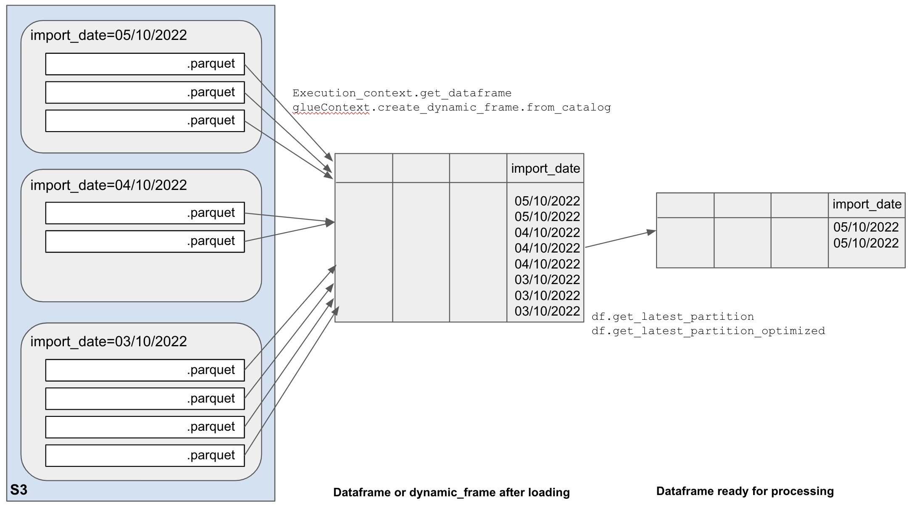
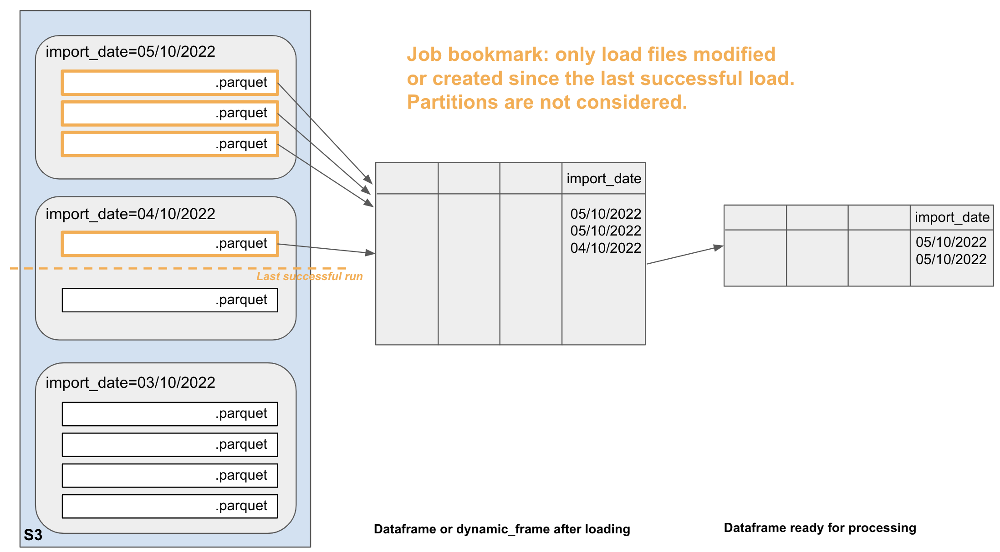
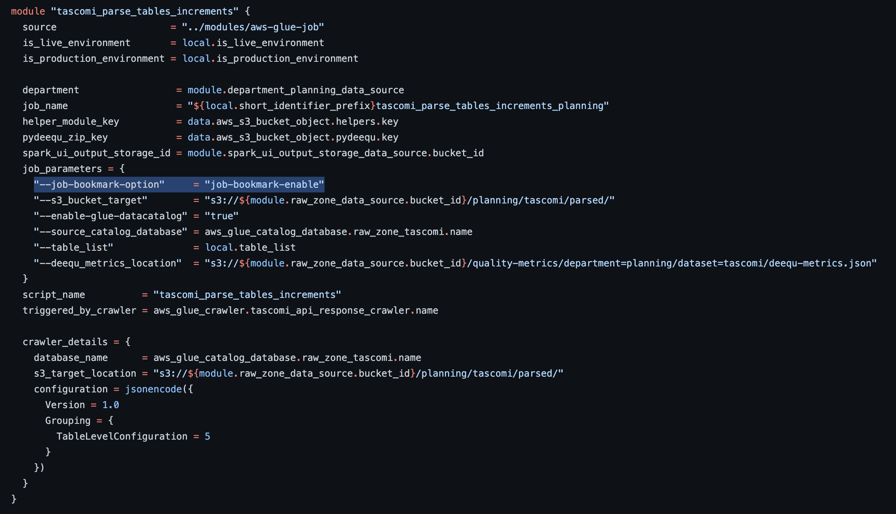
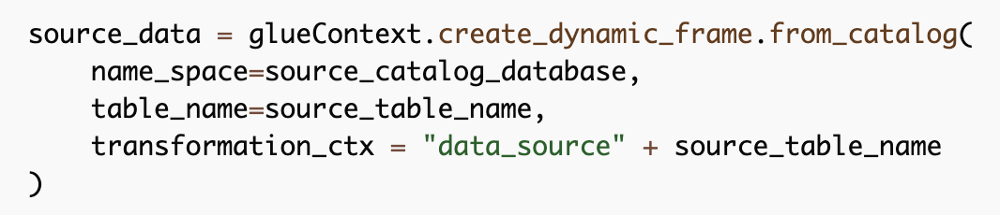

This article proposes a few principles to follow so that Glue jobs don’t run unnecessarily slowly.

# Making sure the job processes the minimum amount of data
Most of the time, we only are interested in the latest partition of the source data. 
When working from the *Trusted zone*, most of the time, only the latest data is available so there is nothing to do. But when working from the refined or the raw zone, historical partitions exist that we need to discard. This section describes several ways to do this.

As shown on the picture below, the typical job first loads some data from S3 using `Execution_context.get_dataframe` or `glueContext.create_dynamic_frame.from_catalog`, and then filters it down to only keep the latest records using `df.get_latest_partition` or
`df.get_latest_partition_optimized`.



There are opportunities to filter data at both stages: before creating the dataframe and afterwards. Options are described below.

## Filtering data before creating the dataframe
In this section we’ll explore job bookmarks and pushdown predicates.

## Job bookmarks
### How it works
Job Bookmark is a Glue feature that operates at file level. It completely ignores partitions. 
With Bookmark on, the Glue job will only load files that have changed or have been created in the source bucket/folder since the last successful run. It will result in a smaller dataframe.



### Pros
- Glue built-in feature.
- Rewind, reset, disable the bookmark in the Glue console without touching the script.
- The bookmark does not rely on crawlers, partitions or catalogue.
- Fine grained filtering: if a new file comes in the middle of the day while others have been processed a few hours earlier, you can run your job and only process the new one. You cannot do that if filtering at partition level.

### Cons
- If an old file changes in the source bucket, it will be processed, whatever partition it is in. To prevent this, additional precautions may be taken (extra filtering using SQL or pushdown predicate).
- Job bookmarks are not very transparent. It is difficult to know what was the last file processed. 
- Users may not know how, or not have permissions to, reset or rewind the bookmark (it used to be only accessible in the legacy pages). 

### Scenarios when not to use it
Bookmarks are not very convenient for a test job that is meant to process several times the same data. Not great if you have several data sources with different filtering requirements: you can choose to use the bookmark or not for each source (using the transformation_ctx in the loading block), but you cannot rewind or reset the bookmark for only one source.

### How to use it in a job
Enabling bookmarks requires 2 steps.
1. In the job parameters or in Terraform: Use the standard job parameter `bookmark=enable` (It is disabled by default in Glue console and in our Job terraform module).



2. In the job script: for incremental data sources that need bookmarking, set the `transformation_ctx` to a unique string value when creating the data frame. For data sources that don't change and need to be processed each time, don't set a `transformation_ctx` and the bookmark won't apply.



### External doc about job bookmarks
https://docs.aws.amazon.com/glue/latest/dg/monitor-continuations.html
https://medium.com/analytics-vidhya/implementing-glue-etl-job-with-job-bookmarks-b76a8ba38dc8
Datasets with different update cycles: https://aws.amazon.com/blogs/big-data/process-data-with-varying-data-ingestion-frequencies-using-aws-glue-job-bookmarks/

## Pushdown predicates
When using a pushdown predicate, Glue will only load partitions (S3 folders) meeting the predicate. 
This example assumes import_date is a partition key: 

```
df = glueContext.create_dynamic_frame.from_catalog(
            name_space=database_name,
            table_name=table_name,
            push_down_predicate = "import_date=='20221001'")
```

This statement results in a smaller dataframe.

How to create the pushdown predicate in a script? Using the DP helpers, there are 2 ways to set the date dynamically:
- Using the current date and adding a few days buffer before this date (i.e. loading everything in the last n days)
- Using the latest partition date by checking the Glue catalogue (i.e. loading the latest written data, whatever its age is)

These 2 approaches and their pros/cons are described below.

