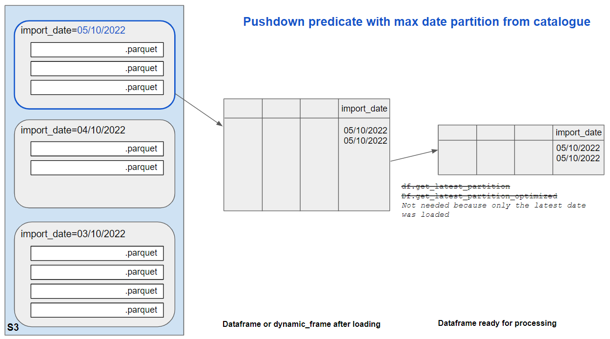

This article proposes a few principles to follow so that Glue jobs don’t run unnecessarily slowly.

# Making sure the job processes the minimum amount of data
Most of the time, we only are interested in the latest partition of the source data. 
When working from the *Trusted zone*, most of the time, only the latest data is available so there is nothing to do. But when working from the refined or the raw zone, historical partitions exist that we need to discard. This section describes several ways to do this.

As shown on the picture below, the typical job first loads some data from S3 using `Execution_context.get_dataframe` or `glueContext.create_dynamic_frame.from_catalog`, and then filters it down to only keep the latest records using `df.get_latest_partition` or
`df.get_latest_partition_optimized`.


There are opportunities to filter data at both stages: before creating the dataframe and afterwards. Options are described below.

## Filtering data before creating the dataframe
In this section we’ll explore job bookmarks and pushdown predicates.

## Job bookmarks
### How it works
Job Bookmark is a Glue feature that operates at file level. It completely ignores partitions. 
With Bookmark on, the Glue job will only load files that have changed or have been created in the source bucket/folder since the last successful run. It will result in a smaller dataframe.

|  | 
|:--:| 
| *In this example, since the last job run, one additional file has been created on the 4/10/2022 and 2 on the 5/10/2022. These 3 files are in different partitions but the bookmarks ignores this fact. The 3 files will get loaded into the same dataframe and processed in the next job run.* |


### Pros
- Glue built-in feature.
- Rewind, reset, disable the bookmark in the Glue console without touching the script.
- The bookmark does not rely on crawlers, partitions or catalogue.
- Fine grained filtering: if a new file comes in the middle of the day while others have been processed a few hours earlier, you can run your job and only process the new one. You cannot do that if filtering at partition level.

### Cons
- If an old file changes in the source bucket, it will be processed, whatever partition it is in. To prevent this, additional precautions may be taken (extra filtering using SQL or pushdown predicate).
- Job bookmarks are not very transparent. It is difficult to know what was the last file processed. 
- Users may not know how, or not have permissions to, reset or rewind the bookmark (it used to be only accessible in the legacy pages). 

### Scenarios when not to use it
Bookmarks are not very convenient for a test job that is meant to process several times the same data. Not great if you have several data sources with different filtering requirements: you can choose to use the bookmark or not for each source (using the transformation_ctx in the loading block), but you cannot rewind or reset the bookmark for only one source.

### How to use it in a job
Enabling bookmarks requires 2 steps.
1. In the job parameters or in Terraform: Use the standard job parameter `bookmark=enable` (It is disabled by default in Glue console and in our Job terraform module).


2. In the job script: for incremental data sources that need bookmarking, set the `transformation_ctx` to a unique string value when creating the data frame. For data sources that don't change and need to be processed each time, don't set a `transformation_ctx` and the bookmark won't apply.


### External doc about job bookmarks
https://docs.aws.amazon.com/glue/latest/dg/monitor-continuations.html
https://medium.com/analytics-vidhya/implementing-glue-etl-job-with-job-bookmarks-b76a8ba38dc8
Datasets with different update cycles: https://aws.amazon.com/blogs/big-data/process-data-with-varying-data-ingestion-frequencies-using-aws-glue-job-bookmarks/

## Pushdown predicates
When using a pushdown predicate, Glue will only load partitions (S3 folders) meeting the predicate. 
This example assumes import_date is a partition key: 

```
df = glueContext.create_dynamic_frame.from_catalog(
            name_space=database_name,
            table_name=table_name,
            push_down_predicate = "import_date=='20221001'")
```

This statement results in a smaller dataframe.

How to create the pushdown predicate in a script? Using the DP helpers, there are 2 ways to set the date dynamically:
- Using the current date and adding a few days buffer before this date (i.e. loading everything in the last n days)
- Using the max partition date by checking the Glue catalogue (i.e. loading the data with the max value for partition date, whatever its age is)
- Using the latest written partition by checking creation timestamps in the Glue catalogue (i.e. loading the latest written data, whatever its age is)

These 3 approaches and their pros/cons are described below.

### Pushdown predicate based on the current date + a few days buffer
This methos loads the current day's partition + the n previous ones.

|  |
|:--:| 
| *In this example, we have 3 partitions for 3 different import_dates. The job runs on the 5/10/2022. Because of the pushdown predicate wih buffer, it will load and process data from the same day's partition, + 1 previous day.* |

#### Pros
This approach gives you a security buffer when you're not sure which is the latest non-empty partition. For instance, if a job runs every day except from the weekend, a 2 days buffer will ensure you always load some data, even on a Monday morning. A 1 day buffer is also useful if you’re not sure if the source data is produced before or after midnight.

#### Cons
- This method can be expensive (i.e. load more data than needed) if you want a large buffer.
- You can miss data if there is a longer gap than expected in the catalogue

#### Scenarios when not to use it
This is not suitable if the data source comes very irregularly, because you may not know which size of buffer to use.

#### How to use it in a job
1. Import the helper function called `create_pushdown_predicate`.
2. Call the `create_pushdown_predicate()` method in the `push_down_predicate` option of the `createDataFrame` block. Pass the name of the partition column as the first argument and the number of days before the current date as the second argument. For instance, to load the data written in the last 7 days, write:


*Warning*: a buffer size of 0 means that you’re loading the full dataset.

3. Later in your script, you can use `get_latest_partitions()` on the resulting dataframe to only keep one day's worth of data.

### Pushdown predicate based on the max value of date partition registered in the Glue catalogue
With this method, a helper queries the Glue catalogue with boto3 to get the max partition value as a string, i.e. '20221005' (this string can also be returned). It then creates a pushdown predicate to load only this partition.

|  |
|:--:|
| *In this example, we have 3 partitions for 3, 4, and 5/10/2022. The job runs on the 7/10/2022. The max import_date partition in the cataloque is '20221005'. The pushdown predicate will be based on this and the job will load and process this partition only.* |

#### Pros
- This approach never loads more than one day’s worth of data, so it is cheap.
- It works even if you have no idea when source data was last produced
- You don't need a GetLatestPartitions query after loading your dataframe

#### Cons
- This approach assumes you have a date partitions with values in 'yyyymmdd' format, and that you know the name of the partition key.
- This approach relies on the Glue catalogue being up-to-date and not containing empty partitions. If data is deleted, we want the corresponding partition to be removed from the catalogue. If crawlers are used to update the catalogue, they must be set up with the non-standard option as below::


#### Scenarios when not to use it
This is not suitable if the catalogue contains deprecated partitions. Not suitable if you don't have a date partition. For instance, it won't support data with only import_year, import_month and import_day.

#### How to use it in a job
1. Import the DP helper method `create_pushdown_predicate_for_max_date_partition_value`
2. Call the method in the `push_down_predicate` option of the `createDataFrame` block (the example below uses the `execution_context` to create the data frame but the same can be achieved using `create_dynamic_frame.from_catalogue`)


### Pushdown predicate based on the latest written partition registered in the Glue catalogue
With this method, a helper queries the Glue catalogue with boto3 to get the all the partitions creation timestamps. It then selected the latest one, get the partitions key-value pairs, and create a pushdown predicate with these.

|  |
|:--:|
| *In this example, we have 3 partitions for 3, 4, and 5/10/2022 but they don't have a date partition, only year/month/date. The job runs on the 7/10/2022. The helper will check the creation timestamps of partitons in the Glue catalogue. It will identify that the partition written on 05/10/2022 is the most recent one and that its partition values are 2022, 10 and 5. The pushdown predicate will be created based on these 3 values and the job will load and process this partition only.* |

#### Pros
- This approach never loads more than one day’s worth of data, so it is cheap.
- It works even if you have no idea when source data was last produced
- You don't need a GetLatestPartitions query after loading your dataframe
- You don't need to know the partition keys and they don't need to have one in 'yyyymmdd' format 

#### Cons
- If the partitions are more granular than a day (i.e. several a day) or less granular, you won't get exactly one day of data
- Like the previous one, this approach relies on the Glue catalogue being up-to-date and not containing empty partitions. If data is deleted, we want the corresponding partition to be removed from the catalogue. If crawlers are used to update the catalogue, they must be set up with the non-standard option as below:


#### How to use it in a job
1. Import the DP helper method `create_pushdown_predicate_for_latest_written_partition`
2. Call the method in the `push_down_predicate` option of the `createDataFrame` block (the example below uses the `execution_context` to create the data frame but the same can be achieved using `create_dynamic_frame.from_catalogue`)


### External documentation about pushdown predicates
https://docs.aws.amazon.com/glue/latest/dg/aws-glue-programming-etl-partitions.html
https://github.com/LBHackney-IT/Data-Platform/blob/main/scripts/helpers/helpers.py

## Filtering data after creating the dataframe
After you have loaded data into a dataframe, you can use a pySpark query that only keeps the latest day from all the loaded data. 
This will work whatever approach you have used to create the dataframe. It does not rely on the Glue catalogue and on registered partitions, but only on the loaded data content. This method has been used in nearly every job in the early Data Platform.

### Pros
Certitude you only are processing one day’s worth of data

### Cons
Can be very expensive if you have loaded many partitions in your dataframe.

### How to use it in a job
1. Import the helper function. Several versions of the helper exist:
- `get_latest_partitions` is the initial version, it uses a `where()` clause and the standard columns `import_year`, `import_month` and `inport_day`.
- `get_latest_partitions_optimized` is a quicker version using `filter()` instead of `where()`
- `get_latest_snapshot_optimized` is the same function as above but uses the partition name `snapshot_date` instead of `import_date`.
- `get_latest_rows_by_date` is the version to use if the partition name is not standard `import_date` or `snapshot_date`. This function lets you pass the partition name as a parameter.

2. Call the method after having loaded the data into a dataframe. It requires a Spark dataframe, not a Glue Dynamic Frame, so you must convert your dynamic frame if necessary.


## Conclusion
We've covered different approaches to make sure the job only processes the data it needs. Many jobs use both filtering before and after loading data into the dataframe. Normally, using a pushdown predicate based on the lasted partition from the Glue catalogue can be used on its own and doesn't require further filtering. Also remember that working from the Trusted zone is he best way to only get the latest data, without needing to filter out older partitions!  

