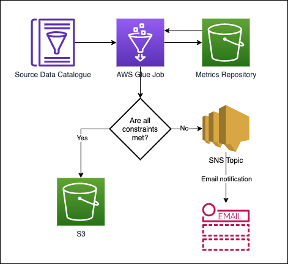

## Context

The Data Platform currently does not have a way to test the data quality of the outputs from Glue jobs

## Decision

Use a Python module; [PyDeequ](https://github.com/awslabs/python-deequ).
PyDeequ enables you to calculate and track changes of metrics
on a dataset, define custom constraints and/or use automated
constraint suggestions to test the quality of a dataset.  
Datasets being consumed by a Glue job will be analysed to produce
metrics (profile of the data), which will be stored in a Metrics Repository
in the respective S3 location of the dataset.
At each Glue job run, the defined constraints will be compared
against the latest metrics from the respective Metrics Repository in S3.
If there are no anomalies in regards to the defined constraints,
then the Glue job will proceed as normal and write the output to
its target S3 location.
If there are any anomalies, then Glue job fails, and the constraint
error message is published as an SNS notification to an email
recipient, notifying them of the error.

## Considerations

- Will need to have a formal review of acceptable constraints per dataset
  consumed by a Glue job.
- On the first run, metrics will be stored without analysing against constraints
  to set a benchmark for future constraint analyses.
- Metrics stored in the Metrics Repository in S3 are stored as JSON files and thus
  should not be picked up by any Crawlers (providing the Crawlers' configuration
  is not changed)

## Consequences

- Users will have confidence that the data being consumed as a result of a Glue job
  is of high quality and can be trusted.
- If there are any anomalies, then users will be notified via email, so that the issue
  can be investigated. Consequently, the Glue job is stopped to prevent passing on the data
  that does not meet the specified constraints to other Glue jobs or Business Intelligence tools.
