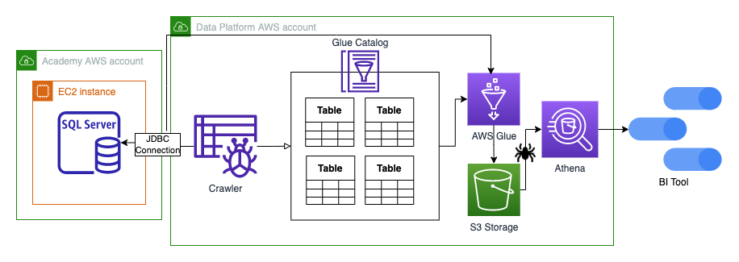

## Context

The Data Platform needs to ingest Academy Insights data from an MS SQL server database but doesn't currently have a process in place to accomplish this

## Objective

Create a reusable process that will enable the ingestion of data from Academy's MS SQL server database and other types of databases

## Decision

A JDBC connection (Glue Connection) can be used to get access and connect to the Academy's MS SQL server database. 
The JDBC connection is used in both the AWS Glue crawler and AWS Glue job (seen in the diagram) to extract data from the SQL views and tables.
- JDBC is a low-level API for making database connections and handling SQL queries and responses. 

With the established connection, a Glue Crawler can crawl the source database (selecting specific tables) and then populate a Glue Catalog database 
with the tables' structures; such as table schemas and other metadata of the specified tables from the MS SQL database.

The tables can be read from the Glue Catalog Database via a Glue job using the same JDBC connection that has connected to the MS SQL source database.
At this point, the data can be transformed as necessary and then written out to S3 and crawled, making it available for querying in Athena and other Business Intelligence tools such as Google Data Studio and Qlik.

## Considerations
- Pulling data into the Data Platform from the MS SQL server database will likely be a very load intensive task on the database and can take some time
- Some questions that still need answering:
    - How can we minimise the impact to users on the Academy Insights database?
    - How often do we pull the data in?
    - How can we ensure we only pull the latest changes to the Data Platform?
    - What needs to be done to the data once it's on the platform so that it's ready to be used by the team for analysis?

## Consequences
- We have a reusable process for ingesting data from different types of databases
- There could potentially be added load on the Academy Insights database which could affect performance without specific measures in place to mitigate this