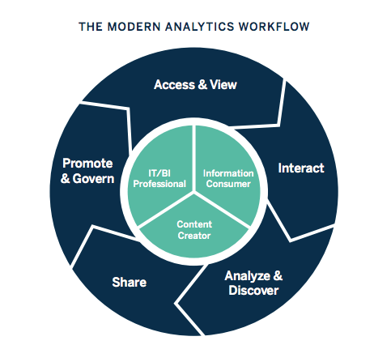
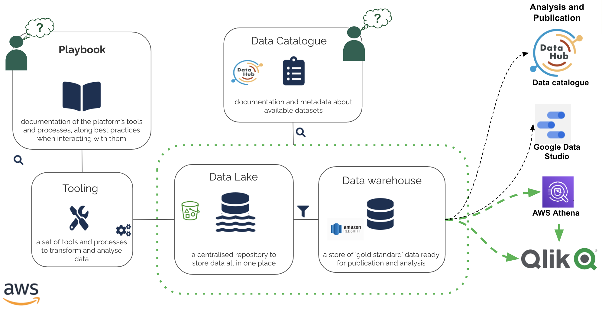

#Module 01: Introduction to Qlik Sense

- View the **video** recording for this module [here](https://drive.google.com/file/d/1u0i_VbUixPnbHvOrhrNvOJyQv48Ltqt5/view?usp=sharing). (For Hackney Council staff only)
- View the accompanying **slidedeck** [here](https://docs.google.com/presentation/d/1CEqU4Wmh_hY1nCHr_044Ed2YC5OYQkNrF-MpVzN42p0/edit?usp=sharing). (For Hackney Council staff only)

##1: What is Business Intelligence?

Business Intelligence (BI) ranges from retrospective Key Performance Indicator (KPI) reporting to forward-looking predictive analysis.

BI provides users with analytical insight and self-serve tools to explore their data.
Over 25+ service areas within Hackney Council are using Qlik dashboards for reporting and analysis. Additionally, the ability to join datasets together for comprehensive cross-cutting analysis.

Tableau.com

###What Business Intelligence isn’t
BI is not report writing - users will still need to interpret their data and draw their own conclusions and decision-making. The BI analyst can help users develop stories about their data, and increase data literacy.

For more statistical analysis and methodological hypothesis testing, we would recommend a data science approach - please come and talk to us in the Data and Insight team if this is something you would like to discuss further.

It also is not to be confused with our Behavioural Insight function in ICT - also known as BI which looks more at changing behaviour within people, for example by looking at ways to change behaviour around recycling within the borough.

##2: What is Qlik?

Qlik Sense is a Business Intelligence visualisation tool - and one of the leaders in the global marketplace.

The flagship product is now Qlik Sense, which has been built upon the QlikView legacy. Other products include NPrint for automatic report emailing.

##3: Qlik vs. competitors

###Strengths
- Available in-browser, no software to download
- The proprietary Qlik data file format (QVD) has high rate of data compression
- A powerful caching ability which means that data is loaded into memory rather than sending a query each time a button is clicked or a filter is selected.
- Can easily cope with >10m rows of data.
- There is also a high level of configurability available within Qlik, which is advantageous when developing and administering dashboards, for example assigning specific permissions specific to individual users.

###Opportunities
- Fast data reload time
- Unique ETL and visualization proposition
- Powerful search capabilities; querying millions of rows of data can take place in seconds, which means Qlik presents a viable alternative to other data visualisation software.
- Ability to customise widgets and visualisations

###Weaknesses

- Qlik does lag behind competitors when it comes to look and feel, and there can be re-sizing issues on different screen types too.
- There is also no public facing offer, so we can't publish dashboards that are accessible by the wider public.
- There is a proprietary syntax and scripting methodology which can take users some time to become accomplished with, especially if a user has no previous SQL experience.

###Challenges

- The Qlik syntax and set analysis can take a while to get to grips with.
- It is also helpful for a user to have some data modelling and script development experience.

##4: How do we use Qlik at Hackney?

Qlik is used across the Council in service areas such as those listed below (not an exhaustive list):
- Planning
- Environmental Operations
- Parking & Markets
- Housing Repairs
- HR and Workforce
- Children’s and Families Service

###How do we use Qlik?

Qlik is primarily used for dashboard creation and report dissemination. 

Qlik did however have an important role in data manipulation and aggregation during this pandemic and post-cyber attack.

Prior to the Data Platform, Qlik was used extensively for extraction, transformation and load (ETL) processes to create date files or QVDs (a Qlik compressed data file format) for use in dashboards.

An advantage of Qlik is that it can connect to a wide range of data sources as well as Google sheets.

###Qlik and the Data Platform
The [Data Platform](https://playbook.hackney.gov.uk/Data-Platform-Playbook/) is a suite of Amazon Web Service tools that include a data lake, data catalogue, data warehouse and tools for processing and visualising data (join the Data Platform Show and Tells to find out more).

The intention is that many of the data transformations previously carried out in Qlik will be managed by the Data Platform, for greater reuse and standardisation.

Qlik can consume datasets from the Data Platform via [AWS Redshift](https://playbook.hackney.gov.uk/Data-Platform-Playbook/glossary#redshift) or [AWS Athena](https://playbook.hackney.gov.uk/Data-Platform-Playbook/glossary#athena) connections and create a data model from them. However, data may still need to be remodelled in Qlik to cater for the dashboard design.

Here is a summary of the key components that make up the Data Platform:

- [Data Lake](https://playbook.hackney.gov.uk/Data-Platform-Playbook/glossary#data-lake) - a centralised repository to store data all in one place
- Tooling - a set of tools and processes to transform and analyse data such as Glue and Sagemaker.
- Playbook - holds documentation and metadata about the Data Platform's tools and processes, along with best practices.
- [Data Warehouse](https://playbook.hackney.gov.uk/Data-Platform-Playbook/glossary#data-warehouse) - a store of ‘gold standard’ data ready for publication and analysis
- [Data Catalogue](https://playbook.hackney.gov.uk/Data-Platform-Playbook/glossary#data-catalogue) - for data discovery

- Analysis and Publication software - in addition to Qlik, the Council also holds licences for AWS Athena and Google Data Studio.

##5: How do you access Qlik?

Qlik is available on the web at [https://qliksense.hackney.gov.uk/saml/hub](https://qliksense.hackney.gov.uk/saml/hub). There is no longer any access via AWS Appstream.

Qlik dashboards ('apps') are grouped into streams per service area with user access permission granted per stream, but other access controls are available.

Please note, by default streams do not have ability to download data from dashboards unless authorisation granted by Information Asset Owners.

###Different user roles

Within Qlik we can assign an individual user a specific _role_ that provides them with the access and functionality that they need for their individual use case. The roles available in Qlik are the following:

- _Consumer_  - can see and interact with dashboard
- _Contributor_ - can see and duplicate sheets to create own visualisations
- _Power User_ - can create apps and load in data
- _Team Admin_ - can publish apps into streams
- _Developers_ - wholesale access 

The majority of Qlik users at Hackney will be assigned a Consumer or Contributor role.

##6: How do dashboards work?

We have set up an example dashboard for anyone at Hackney Council to access. It is a simple dashboard and allows users to get familiar with simple dashboard tasks. 

The dashboard is available at [https://qliksense.hackney.gov.uk/saml/hub](https://qliksense.hackney.gov.uk/saml/hub) (your access will be authenticated by your Hackney Google login) under the 'Everyone' stream.

View the step-by-step tutorial in the [Module 1 training video](https://drive.google.com/file/d/1u0i_VbUixPnbHvOrhrNvOJyQv48Ltqt5/view?usp=sharing) in Part 6 at 14:30:00.

##7: How to get started?

###How to get started with Qlik

We have active Qlik developers in CFS, ASC, Regen, Housing and Parking who are developing dashboards for their service area, with support from Data and Insight.

Additional service areas have already requested training in how to develop their own dashboards from scratch.

We encourage self-service as we have limited resources within the Data and Insight team.

###What we can offer
If you are already developing or accessing Qlik dashboards and need some guidance, then we will shortly  offer Qlik surgeries on a fortnightly basis (drop-in). These will be advertised on the Open Events calendar.

If you have a business need to develop a Qlik dashboard then please contact [daro.clark@hackney.gov.uk](daro.clark@hackney.gov.uk) to discuss further.

###How to get help
- First of all see if there is a Qlik expert or contact in your service area - someone else might have had this problem already and resolved it.
- Attend the drop-in surgery (check the Open Events calendar for dates)
- Otherwise for access problems or bugs raise a ticket through Hackney’s support desk, **Halo** - you can do this by simply emailing [data.platform@hackney.gov.uk](data.platform@hackney.gov.uk)

##Who we are

Within the Data and Insight tea

- [David Evans](david.evans2@hackney.gov.uk) - Business Intelligence Developer
- [Daro Clark](daro.clark@hackney.gov.uk) - Data & Insight Analytics Lead
- [Anna Gibson](anna.gibson@hackney.gov.uk) - Data & Insight Analyst

##Recommended Resources

Here are a list of resources that colleagues have used to further their Qlik understanding. Please let us know anything that you think should be added to this list!

###Qlik dashboards at Hackney Council
List of dashboards published at Hackney Council [Link](https://docs.google.com/spreadsheets/d/1cLukqs7VHMqm4xqfylc2Z8IU0ioov0wOoSMQW1B0I3Q/edit?usp=sharing)

###Video tutorials
- Qlik Sense Tutorial for Beginners - Qlik Sense Training [Link](https://youtu.be/6KHs0xa-jgE)
- Qlik Sense Basic Tutorial for beginners - Getting started [Link](https://youtu.be/zs24DVVIALU)
- Introduction to Set Analysis - Qlik Sense [Link](https://youtu.be/hxsKnftVECk)

###Dashboard templates and ideas
Quick Intelligence dashboard templates [Link](https://www.quickintelligence.co.uk/examples/)

