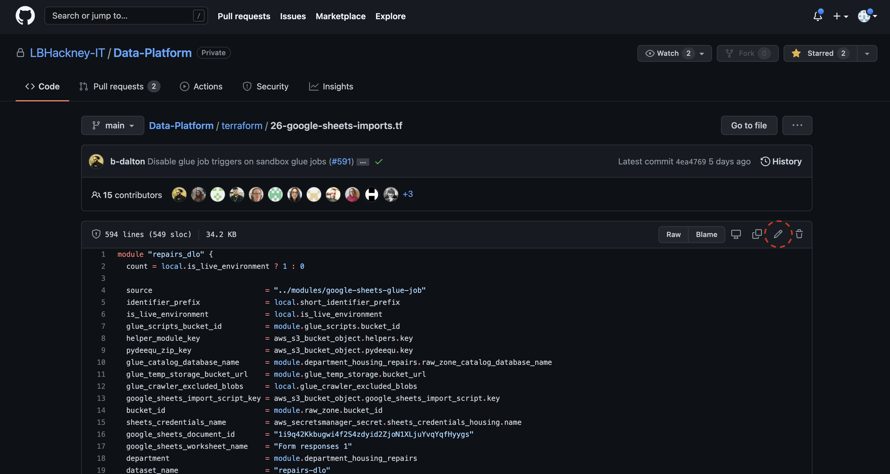
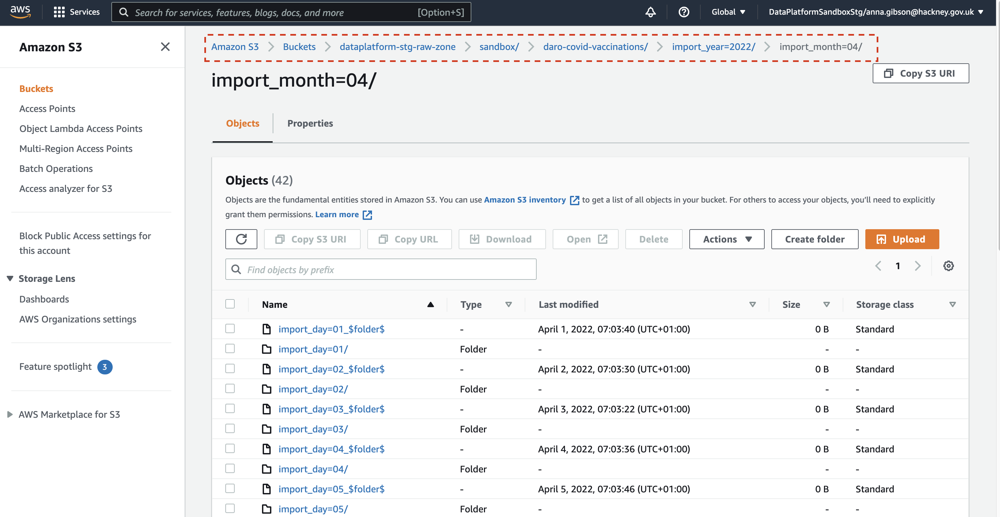

# Module 1 - Ingesting data from Google Sheets

In this module you will ingest two datasets into the Data Platform from Google Sheets. This will involve creating an AWS [Glue](https://lbhackney-it.github.io/Data-Platform-Playbook/glossary/#glue) job using [Terraform](https://lbhackney-it.github.io/Data-Platform-Playbook/glossary/#terraform) as well as [GitHub](https://lbhackney-it.github.io/Data-Platform-Playbook/glossary/#github) for making changes to the Data Platform code repository. Once your changes have been approved by the Data Platform team, you will then crawl the loaded data, to then be able to view and query it in [AWS Athena](https://lbhackney-it.github.io/Data-Platform-Playbook/glossary#athena), a database-like web client.

&nbsp;
## Step-by-step instructions

Please ensure that [Module 0](https://playbook.hackney.gov.uk/Data-Platform-Playbook/playbook/training-modules/Module-0) is completed before starting this module.

&nbsp;
### 1. Preparing the Google Sheet for this exercise
Make a copy of this Covid vaccination [data](https://docs.google.com/spreadsheets/d/1-ZNoQGu0LGlaKYDBWD8MUo8hqfcnE5YbgCXVz2MUxSw/edit#gid=2146898708) and name the Google Sheet as `covid_vaccination_data` in your own Google Drive. We are going to use the tabs *locations* and *vaccinations*.

&nbsp;
### 2. Granting the Data Platform access to your new Google sheet
We have created a `sandbox` department in the Data Platform, and an associated Google service account: `sandbox@dataplatform-stg.iam.gserviceaccount.com`
- The Data Platform will use this account to connect to your Google sheet. 
- Use the sharing settings of your sheet and grant “Viewer” permissions to this user.
- [Detailed steps](https://playbook.hackney.gov.uk/Data-Platform-Playbook/playbook/ingesting-data/google-sheets-import#preparing-a-google-sheet-for-ingestion) are in the Playbook.

&nbsp;
### 3. Creating two ingestion jobs in Terraform
Your Google sheet is going to be ingested by a job running in AWS [Glue](https://lbhackney-it.github.io/Data-Platform-Playbook/glossary#glue). You will write a bit of [Terraform](https://lbhackney-it.github.io/Data-Platform-Playbook/glossary/#terraform) that will deploy this job automatically in the AWS environment. You are going to write this code directly in your web browser in GitHub [here](https://github.com/LBHackney-IT/Data-Platform/blob/main/terraform/26-google-sheets-imports.tf), adding to the existing terraform script `26-google-sheets-imports.tf`.

You could also write the job locally within your interactive development environment, but editing via the GitHub web interface will be easier in this case as you won't need to clone the repository.

You will need to create two modules within the terraform script as we are ingesting two datasets from the Google spreadsheet:
- locations
- vaccinations

i. Go to the Playbook to view [detailed steps](https://playbook.hackney.gov.uk/Data-Platform-Playbook/playbook/ingesting-data/google-sheets-import#setting-up-the-aws-glue-job) on how to create a terraform module.

Additionally, please complete the following steps:

ii. Your department name will be `sandbox` for the purpose of the training e.g. `module.department_sandbox`.

iii. Suffix your new Terraform module name with the department `sandbox` and `your_name` so that each participant’s job will be easily identifiable. The module name will need to also reflect the individual dataset so make sure that the dataset name is also included within the module name e.g. `sandbox_joe_bloggs_covid_vaccinations`.

iv. Prefix the dataset_name with your name e.g `joe_bloggs_covid_vaccinations`.

v. No schedule is required as this is a one-off import, so this line does not need to be included within the module.

&nbsp;
### 4. Getting your jobs deployed to the Data Platform
The next step is to commit your changes to the [Data Platform GitHub repository](https://github.com/LBHackney-IT/Data-Platform). Follow the instructions [here](https://playbook.hackney.gov.uk/Data-Platform-Playbook/playbook/getting-set-up/using-github#committing-your-changes-to-the-data-platform-project) on how to do this.

Create a [Pull Request](https://docs.github.com/en/pull-requests/collaborating-with-pull-requests/proposing-changes-to-your-work-with-pull-requests/about-pull-requests) (PR) for the changes to the Terraform script that you have just made. **Two approvals** are required before your code can get merged into the *main* branch of the Data Platform repository. If you know the names of your reviewers, you can send them the URL of your PR to speed up the process. 

Once you have received confirmation that two reviewers have approved your PR, go back to GitHub and merge your code. This will deploy your job out to Data Platform Pre-Production environment. This only happens once. From that point onwards, you will be able to see it in the AWS console, and it will run on schedule or manually, depending on how it was configured in Terraform. 

>:warning: There will be a 10-15 minute delay whilst the code deployment takes place. You can take a break or look at a ready-made job in the interim. To check the status of your deployment, navigate to the Actions tab in the Github web interface.

In everyday use you may not need the data to be immediately available, in which case steps 5-7 would be picked up by the scheduled daily jobs, provided a schedule is specified in the Terraform module. 

Log in to [AWS][hackney_sso] as the `DataPlatformSandboxStg` role via the `Management Console` for that role.

&nbsp;
### 5. Finding and running your jobs in the AWS console

>:bulb: You can search for AWS tools like AWS Glue, Crawlers etc. using the toolbar. If you cannot find a job or crawler check the region is London in the top right of the screen.

Your jobs should now be available within [Glue Studio](https://eu-west-2.console.aws.amazon.com/gluestudio/home?region=eu-west-2#/jobs). They will be named like `stg Google Sheets Import Job - department-dataset-yourname`.

>:warning: If you are waiting for code deployment to complete, then look for `stg Google Sheets Import Job - sandbox-daro-covid-locations` and `stg Google Sheets Import Job - sandbox-daro-covid-vaccinations` jobs instead.

Once you have selected a Glue job, you can run it by clicking `Run job` 
To monitor the progress of your Glue job run, click through to the Glue job and navigate to the `Runs` tab.

It is sometimes helpful to check the specific output [S3][s3] bucket for a job to see if it has run; the parquet files will be partitioned by date.
You can find the data by navigating to the location highlighted in the screenshot below but using your job name instead of `daro-covid-vaccinations`.
You should see data for todays date under the job you have run.

&nbsp;
### 6. Crawling the ingested data to make it available in the Glue catalogue. 
`Crawling` is the mechanism used to populate the AWS Glue Data Catalog so that data is made visible in Athena by picking up the column names and data types. 

i. Once the Glue jobs have successfully run, go ahead and run the crawlers that were created as part of the import job. You can use the AWS search bar to locate the [Crawlers][glue_crawlers] page. To search for your Crawler, click on the search box and then select the `Name` filter and enter the name of your crawler, and click run.

ii. Check the data in [AWS Athena][athena_query_editor], the interface to view and query data from the Glue Catalogue.

iii. Open the `Query editor`.

iv. Make sure workgroup is `sandbox` and you are using the `sandbox-raw-zone` database. Run a simple query in Athena against your tables created or updated by the crawlers. You can generate a SQL preview query by selecting the three vertical dots by the table name and select `Preview Table` to see the top 10 lines. The dialect of SQL used in Athena is [Presto SQL](https://prestodb.io/docs/current/sql.html).

v. You should now be able to repeat steps 6-9 for the job that *you* created as the code should now have been deployed into to main Data Platform repository.

&nbsp;
>:raised_hands: Congratulations! You have completed Module 01!

[hackney_sso]: https://hackney.awsapps.com/start#/
[s3]: https://s3.console.aws.amazon.com/s3/home?region=eu-west-2
[athena_query_editor]: https://eu-west-2.console.aws.amazon.com/athena/home?region=eu-west-2#/query-editor/
[glue_crawlers]: https://eu-west-2.console.aws.amazon.com/glue/home?region=eu-west-2#catalog:tab=crawlers