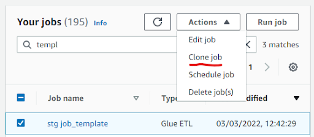
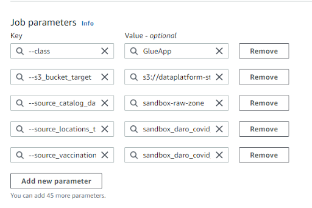

---
title: Module 3 - Deploying a job in Glue
description: "Training Module 3"
layout: playbook_js
tags: [training]
---

# Module 3 - Deploying a job in Glue

In this module, you will turn the transformation script you created in [module 2][module_2] into a Glue job and ‘productionize’ it. At the end of the module, you will have a Glue job (and Crawler) that is managed by the Data Platform infrastructure and code repository which you can use to carry out your tasks.

## Overview

First, you will be carrying over your transformation script from Sagemaker into the Glue console, where it will become a Glue job. You'll test this job and check your data like you did in Module 1. 

Then, you will deploy the same job following the Data Platform standard process. This involves two main changes:
  * Your Glue job will be coded in Terraform. When deployed, Terraform will generate all the necessary infrastructure in the AWS environment (job, crawler, scheduler). This will replace the elements you’ve created manually in the AWS console in the second part of Module 2. This is ‘Infrastructure as Code’ (IaC) and brings a lot of advantages to the Data Platform:
    * Quality assurance: we use Terraform templates so all elements of infrastructure follow the same standards
    * Repeatability: your job can be recreated by a simple redeployment if anything goes wrong. It can also be replicated to another environment, for instance from Staging to Production
  * Both the PySpark script and the job details in Terraform will become part of the Data Platform code base and saved in Github. This also brings advantages:
    * Safety: Your code cannot be accidentally lost and is version-controlled
    * Quality assurance: Your code will be reviewed by at least 2 engineers. Github will also perform automated checks which must pass before merging it into the repository

## Prerequisites

Please ensure that both [Module 0][module_0], [Module 1][module_1] and [Module 2][module_2] are completed before proceeding.

## Part 1. Prototyping the job in the AWS glue console

You’ll take the following steps before productionising the script you wrote in Module 2, to check it runs smoothly as a job in the AWS glue environment (it should, because the notebook environment you used in Sagemaker runs against glue).
It will be an opportunity for you to try logging.
As we’re just testing, we won’t write any Terraform (we'll do this in the second half of this module) and we won’t schedule the job. 
We’ll also delete our job at the end.
If you need more detailed instructions at any point checkout [the guide to set up an ETL job][setting_up_etl_job].

### Detailed steps for part 1: 
1. Login to AWS pre-production acccount via the [Hackney SSO][hackney_sso].
2. Set up a new job in Glue Studio. You can start from a template.
    * Go to [AWS Glue Studio][aws_glue_studio] and open the Template job, called "stg job_template".
    * Clone the job (from Actions) and rename it with your name and remove "stg" from the prefix, for example "jane doe template".
    * Open the job and familiarise yourself with the steps (reading, transforming and writing data) and note the differences compared to the Notebook template.

    
3. Write your job.
    * In a different tab, open Sagemaker and navigate to the notebook you created in Module 2.
    * Paste your code from the notebook into the template, ignoring the first cell (Cells can be merged in Jupyter by holding `Shift` and selecting the cells, then pressing `Shift+M` on your keyboard).

    * For the variables defined in the first cell of your notebook, you will use the `Job details` tab instead of writing them in the script.
    You should define them in the **Job parameters** panel which can be found under `Advanced properties`. 
      You should also update the S3 path in the **Script path** field to `s3://dataplatform-stg-glue-scripts/custom/`. 

    
4. Run your job.
5. Review the run result logs.
See the [monitoring section][monitoring_jobs] of the using Glue Studio guide for an explanation on how to do this.
6. Once your job status has changed from `Running` to `Succeeded` you should check the data wrote correctly into [S3][s3].
To do this, follow the same steps in the [last section of Module 1][module_1_step_6].
7. [Crawl][glue_crawlers] the results. (Using the crawler named “sandbox-refined-zone”).
8. Check the data in [Athena][athena_query_editor] - ([playbook][querying_with_athena]).

Congratulations, you've tested that your transformation is working in Glue. You can move to the next part of Module 3.

## 2. Part 2: Deploying your job via Terraform
In this second part of Module 3, you will ‘productionize’ the job you’ve tested in the previous part. To do this, you will write a Terraform module in the Data Platform GitHub repository and you'll deploy it. The entirety of this module will be carried out in the GitHub User Interface, but you could also work in your IDE if you prefer. 

### Overview of the steps for part 2: 

* First, you’ll delete the data you've created in part 1 as they will get created again in this part.
* Then, you will save your PySpark script at the relevant location of the DP repository. You already have the code ready.  
* Then, you will write a Module in Terraform that encapsulates all the resources your Glue job requires.
* You will then create a Pull Request and merge your code with the Pre-Production DP repository
* At this point, Github will attempt to deploy your code, and your job will get created in AWS. 
* You’ll be able to retrieve your Glue job in the AWS console, to run it, and check the results in Athena. 

### Detailed steps for part 2: 
9. Delete the data generated in Part 1 of this module
This is to avoid getting confused at the end of this Module, as you will be running the newly deployed job, generating the same data again. To delete your data, navigate to it in S3 (Refined zone bucket, Sandbox department) and permanently delete the 2 full folders with your name (there should be one folder for Locations and one for Vaccinations). *Do NOT* delete your data from the Raw zone, otherwise you would have to ingest it again by running the ingestion job created in Module 1!

10. Create your PySpark script in the repository
This step can be done in Github in the browser, or in your IDE (in this case make sure you have pulled the last version of the DP repository).
Follow the steps from the [Using GitHub Playbook article][using github], part 1.
Add your name at the end of the file name. An name example is *covid_vaccinations_arda.py*.
When you validate your new file in GitHub, do not create a Pull Request straight away. Look at the name of the new branch you are creating (you can aben customise it). You'll use the same branch in the next step and raise one PR at the end.

11. Define your job in a Terraform module
A module is a block of Terraform script that creates a set of related resources in AWS. The DP team has created a module template for Glue jobs. An [example from the Playbook][job module in playbook] is reproduced below. As you can see, it includes:
* The job name and department
* The location of the pySpark script
* The schedule of the job
* The job parameters (everything you defined manually in ‘job details’ in the Glue console)
* A crawler to crawl the results of your job as soon as it has completed
  
You’ll create your module in the existing file: [terraform/25-aws-glue-job-sandbox.tf][job module in repo - sandbox]. This link takes you to the main branch of the repository, but you should make sure you are in the branch you've created in the step below. To switch to a branch, yu 

To create your module, follow the steps from the [Playbook, Part 2][job module in playbook]. 
Please *add your name* at the end of the module name and the job name.
Please *DON’T* add a schedule to your module, you’ll just run it manually later.
*TIP*: the example above doesn’t contain all the mandatory fields… make sure you read the Playbook carefully so you don’t forget any! If you do, GitHub won't let you commit your work.

12. Have your code reviewed
Commit your code to your current branch. Then, open a Pull Request. It contains your new script and your new module.

13. Deploy to the Data Platform
When you have received 2 approvals from reviewers, go back to GitHub. You will now be able to merge your branch (the merge button is green). 

The automated deployment will now start and take several minutes.
To check how it is going, you can navigate to the [Actions tab][github actions] and monitor the progress of your code deployment. 
A reason for deploy failure is when a resource declared in Terraform (for instance a pySpark script file) is missing from the AWS environment. If this is happening, make sure all the necessary resources have been deployed before re-trying to deploy yours.

14. Check your new resources in the AWS console. 
In the [Glue Studio page][glue studio], you should find your Glue job with the prefix “stg-” added. In the [Glue Crawlers][glue crawlers] page, you should find the associated crawler. You can easily link the details of these new resources to the statements you wrote in the Terraform module.

15. Run the deployed job
You can run your job manually from Glue Studio. After it has completed, the job will trigger the crawler so you don’t need to run it yourself. If you navigate to the Crawler page, you should see your crawler in the ‘running’ state.

16. Check the resulting data in Athena - the interface to view and query data from the Glue Catalogue.
* Open the [Query editor][Athena query editor]
* Make sure workgroup is “sandbox” and you’re using the “sandbox-raw-zone” database
* Run a simple query in Athena against your tables (created/ updated) by the Crawlers. A simple way to do this is to select the 3 vertical dots by the table name and select “Preview Table” to see the top 10 lines. (The dialect of SQL used in Athena is Presto SQL)

17. Delete the job prototype you've created manually in the console in the oart 1 of this module
If the deployed job has worked successfully, you can safely delete the one you created manually earlier - your code is now in the DP codebase!  

Congratulations, you've completed this module and deployed a job in the data platform! 

[module_0]: ./module-0.md
[module_1]: ./module-1.md
[module_2]: ./module-2.md
[module_1_step_6]: ./module-1.md#6-crawling-the-ingested-data-to-make-it-available-in-the-glue-catalogue
[about_pyspark]: https://spark.apache.org/docs/latest/api/python/
[about_glue]: https://aws.amazon.com/glue/?whats-new-cards.sort-by=item.additionalFields.postDateTime&whats-new-cards.sort-order=desc
[about_jupyter]: https://jupyter.org/
[pyspark_by_example]: https://sparkbyexamples.com/pyspark-tutorial/
[aws_glue_studio]: https://eu-west-2.console.aws.amazon.com/gluestudio/home?region=eu-west-2#/jobs
[querying_with_athena]: ../playbook/querying-and-analysing-data/querying-data-using-sql.md
[sagemaker_article]: ../playbook/transforming-data/using-aws-glue/006-using-sagemaker.md 
[setting_up_etl_job]: ../playbook/transforming-data/using-aws-glue/001-using-glue-studio.md
[monitoring_jobs]: ../playbook/transforming-data/using-aws-glue/001-using-glue-studio.md#monitoring-a-glue-job-run
[hackney_sso]: https://hackney.awsapps.com/start#/
[s3]: https://s3.console.aws.amazon.com/s3/home?region=eu-west-2
[athena_query_editor]: https://eu-west-2.console.aws.amazon.com/athena/home?region=eu-west-2#/query-editor/
[glue_crawlers]: https://eu-west-2.console.aws.amazon.com/glue/home?region=eu-west-2#catalog:tab=crawlers
[refined_zone]: ../glossary.md#refined-zone
[using github]: https://lbhackney-it.github.io/Data-Platform-Playbook/playbook/transforming-data/using-aws-glue/deploy-glue-jobs/#1-add-your-script-to-the-data-platform-project-using-the-github-ui
[job module example]: https://lbhackney-it.github.io/Data-Platform-Playbook/playbook/transforming-data/using-aws-glue/deploy-glue-jobs/#example-module-block
[job module in repo - sandbox]:https://github.com/LBHackney-IT/Data-Platform/blob/main/terraform/25-aws-glue-job-sandbox.tf
[github actions]: https://github.com/LBHackney-IT/Data-Platform/actions
[glue studio]: https://eu-west-2.console.aws.amazon.com/gluestudio/home?region=eu-west-2#/jobs
[glue crawlers]: https://eu-west-2.console.aws.amazon.com/glue/home?region=eu-west-2#catalog:tab=crawlers
[Athena query editor]: https://eu-west-2.console.aws.amazon.com/athena/home?region=eu-west-2#/query-editor
